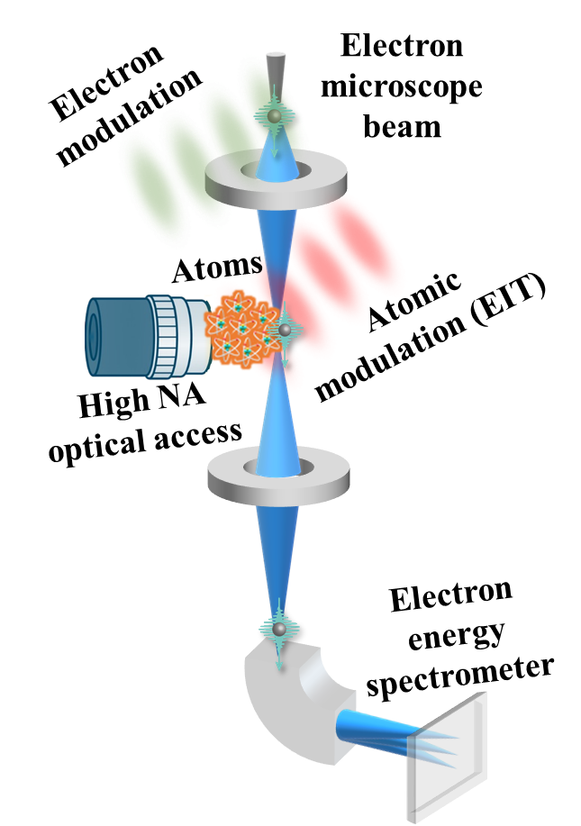

::: {.q-section}
::: {.two-col}
:::: {}
[What do we do?]{.eyebrow}

## Electrons, atoms and photons — together

::: {.lead}
We develop quantum technologies that use simultaneous control over **free electrons**, **atoms** and **light**. By bringing cold atoms and lasers into the beamline of an electron microscope, we create new ways to generate, shape and measure quantum states of light and matter.
:::

::: {.tagline}
.
:::

[Our research](research.qmd){.btn-q} [Publications](publications.qmd){.btn-q .outline}
::::
:::: {}
{fig-alt="Concept: an electron-microscope beam passes through a cloud of atoms with high-NA optical access, and its energy is measured by an electron spectrometer."}
::::
:::
:::

::: {.q-soft}
::: {.q-section}
[Three ingredients]{.eyebrow}

## One lab

::: {.pillars}
:::: {.pillar}
[e⁻]{.letter}

### Free electrons
Electron-microscope beams shaped and modulated by light — coherent quantum probes with exquisite spatio-temporal resolution.

::::
:::: {.pillar .blue}
[Rb^87^]{.letter}

### Atoms
Cold atomic clouds and atom arrays, controlled with lasers to engineer their quantum state and electromagnetic vacuum properties.
::::
:::: {.pillar}
[γ]{.letter}

### Photons
lasers and quantum light emitted by atoms or free electrons, sometimes coupled to nanophotonic devices.
::::
:::
:::
:::

::: {.q-section}
[Latest]{.eyebrow}

## News

::: {#latest-news}
:::

[All news →](news.qmd)
:::

::: {.q-section}
::: {.cta}
:::: {}
### We are hiring!

::::
[Join the lab](contact.qmd){.btn-q}
:::
:::
